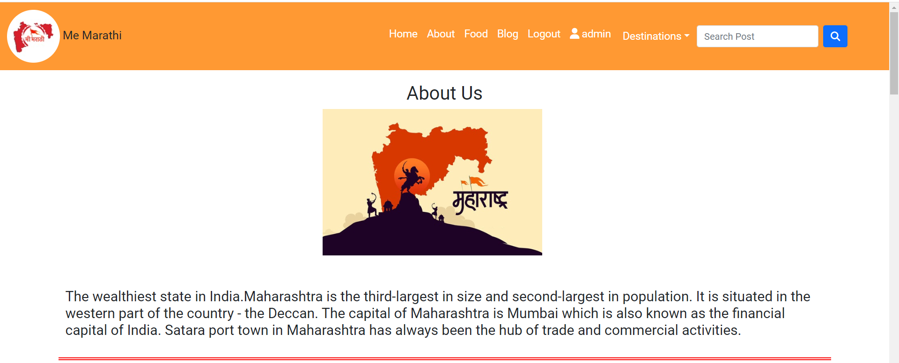
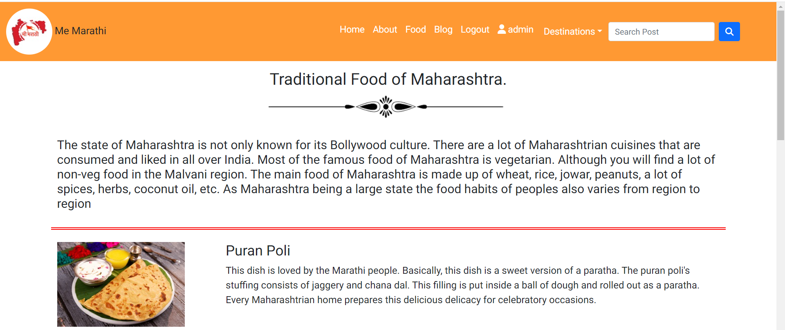
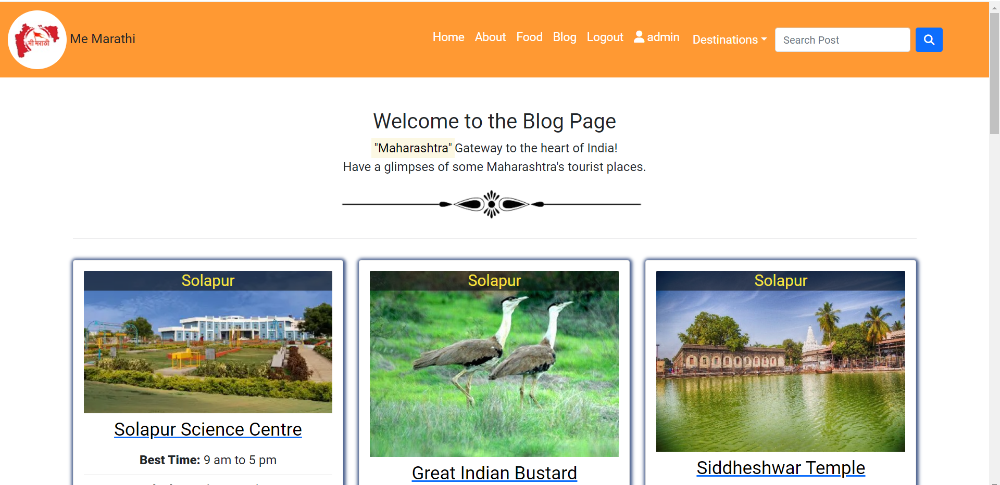
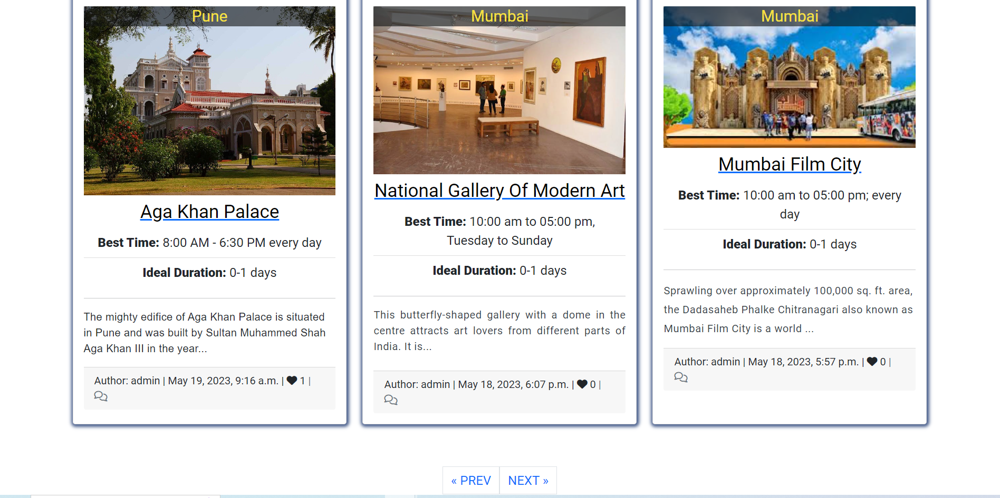

# Me Marathi 

**Me Marathi** blog website is developed using Django Framework as part of Portfolio Project 4 for my Diploma in Full Stack Software Development at Code Institute.

It targets **tourist destinations** of Maharashtra, where user can view the blog post of tourist destinations, blog post and comments. When the user is logged in, user can like/unlike a post, comment on a post and add a post from the user page.

You can view the live site here:- 


## [Content](#content)
- [Me Marathi- Introduction](#me-marathi---introduction)
  - [User Experience - UX](#user-experience---ux)
    - [Site Aims](#site-aims)
    - [Agile Methodology](#agile-methodology)
      - [Epics and User Stories](#epics-and-user-stories)
      - [Tasks](#tasks)
  - [Design](#design)
    - [Colours](#colours)
    - [Typography](#typography)
    - [Imagery](#imagery)
    - [Wireframes](#wireframes)
  - [Database Diagram](#database-diagram)
  - [Features](#features)
    - [Home Page](#home-page)
      - [Navbar](#navbar)
      - [Hero Image](#hero-image)
      - [Destination Section](#destination-section)
      - [Footer](#footer)
    - [User Page](#user-page)
    - [About Page](#about-page)
    - [Food Page](#food-page)
    - [Blog Page](#blog-page)
      - [Blog Details](#blog-details)
      - [Blog Comments](#blog-comments)
    - [Register](#register)
    - [Login](#login)
    - [Logout](#logout)
    - [Destinations](#destinations)
    - [Search Button](#search-button)
    - [Alert Messages](#alert-messages)      
  - [Admin Panel/Superuser](#admin-panelsuperuser)
  - [Technologies Used](#technologies-used)
    - [Languages Used](#languages-used)
    - [Django Packages](#django-packages)
    - [Frameworks - Libraries - Programs Used](#frameworks---libraries---programs-used)
  - [Testing](#testing)
      - [Validation](#validation)
      - [Manual Testing](#manual-testing)
  - [Bugs](#bugs)
      - [Fixed Bugs](#fixed-bugs)
      - [Unfix Bugs](#unfix-bugs)
  - [Deployment](#deployment)
      - [Creating the Django project](#creating-the-django-project)
      - [Creating Heroku app](#creating-heroku-app)
      - [Set up Environment Variables](#set-up-environment-variables)
      - [Heroku deployment](#heroku-deployment)
      - [Final Deployment](#final-deployment)
  - [Credits](#credits)
    - [Content](#content)
    - [Information Sources / Resources](#information-sources--resources)
  - [Acknowledgement](#acknowledgement)


# User Experience - UX

## Site Aims

* Me Marathi is a website mainly meant to explore the Maharashtraian tourist destinattions with a good user experience.
* The site aims to provide user with a visually pleasing and informative website that is intuitive to use and easy to navigate.
* This website provides the user with the ability to read and view posts, as well as tools that allow users to search for a particular destination posts.
* All users who sign up and sign in, can access the features of add post, like/unlike and comment on a blog post of this website.
* User can access all the features of the website and can read, create, edit, and delete their own posts.


## Epics and User Stories

Following Epics were created which were further developed into below User Stories.

### Epic 1- Website UI
Epic Goals for User- 
* An intuitive User Interface with easy to navigate throughout the website 
* Easily see the purpose of the site from the landing page
* View a list of destinations and blog posts
* Search bar for quick and easy access to required information

#### Related User Stories:
* As a site user I can easily see the purpose of the site from the landing page so that I can see if the site is relevant to my needs.
* As a site user I can view a list of destinations so that I can see a list of posts relating to my specific interest.
* As a site user I can view a paginated list of posts so that easily select a post to view.
* As a site user I can click on a post so that I can read the full article.
* As a site user I can use a search bar to search for a specific place so that I have quick and easy access to the information I need.

### Epic 2- Registration and Account Management
Epic Goals-
* Easy registration of an account
* Easy Sign Up, Sign in and Sign Out
* Upon signing in, the user should be able to like, comment on a blog post
* Easy access to Create, Read, Update and Delete (CRUD) features upon signing in
* Visibility of personalized blog posts and comments

#### Related User Stories:
* As a site user, I can register an account so that I can comment and like.
* As a registered user, I can login and logout of the site so that I can access my content.
* As a site user, I can view the number of likes on each post so that I can see which is the most popular or viral.
* As a site user, I can view comments on an individual post so that I can read the conversation.
* As a registered user, I can create a post of tourist place so that I can share it with other.

### Epic 3- Blog Post Management
Epic Goals-
* Create/ Update / Read / Delete blog posts.
* View their created blog posts
* Approve and publish a post

#### Related User Stories:
* As a site admin, I can create draft posts so that I can finish writing the content later.
* As a site admin/author, I can create, read, update and delete posts to manage the blog content.
* As a site admin, I can delete any comment so that I can filter out objectionable comments.
* As a author, I can access all my blog posts easily in one place so that I can easily track my activity on the site.

### Epic 4- Comments and Like Management
Epic Goals-
* Add /Delete and View Comments on a post
* Like / Unlike a post

#### Related User Stories:
* As a logged-in user I can leave comments on a post so that I can be involved in the conversation.
* As a logged-in user I can edit/delete my comments so that I can update/delete my post opinion.
* As a logged-in user I can like or unlike a post so that I can interact with the content.

## Tasks

The tasks for the website development process was closely followed as mentioned in CI's Django module "I Think Therefore I Blog" walkthrough project. The task is generally the developers step towards preparing the app.
The tasks that I have followed during the development phase were carried out in this order.
## Agile Methodology

The Agile Methodology was used to plan this project. This was implemented through Github and the Project Board. Through the use of the Kanban board in the projects view in Github, the project was divided into a few different sections: 

* To Do- (All the User stories were initially entered in the 'To Do' column)
* In Progress- (then during development story they were moved into the 'In Progress' column)
* Done- (and then finally they get moved into 'Done' once the development completes)

Please find my Kanban Board with my user stories


**Before Project Inception**

- Design ERD and Data 
- Create Repository in GitHub
- Create Project, Epics, User Stories and prepare Kanban Board

**Creation of Project in GitPod**

- Create the django project. Check details in [deployment-section](#deployment)
- Deploying app to Heroku - Details in [deployment](#deployment) section
- Create Database Models
	- Set up models.py file in "blog" directory
- Build Admin site
- Set up Templates
	- Create base.html - Navbar and Footer content, which gets extended to all the other template files
	- Add responsiveness to navigation and footer
    - Create index.html, view and style
	- Set up template file features with views.py and urls.py
  - about.html (Description about Me Marathi)
  - Food.html (Description about traditional food)
  - blog.html (to view all blog posts)
  - user_page.html (for user's personal collections)
  - post_details.html (for detailed post view)
  - edit_comment.html (to update the comment)
  - destinations_post.html (to view blog post for a selected destination)
  - add_post.html (to allow user's input for blog posts)
  - delete_post.html (to allow user to delete his post)
  - search.html (to search a blog post)
  - update_post.html (to allow user to edit his post)
  - user_post_list.html (to allow user to view all post, which he posted so far)
- Install Allauth for sign in, sign up and sign out templates with-  pip3 install django-allauth 
	- Install crispy-forms to add styles to Django account templates with-  pip3 install crispy-bootstrap5
- Intensive Manual Testing and Validation checks of each page and codes written
- Final Deployment steps


[Back to top](#content)

## Design

### Colours

The colour scheme has considered based on easy accessibility for all and have been consistently maintained throughout the website. The colours were modified using [Colorswall](https://colorswall.com/). 

![Color Palette]

### Typography

Fonts were imported using Google Fonts. Roboto was used throughout with a backup of sans-serif. It was chosen for easy readability for users.

### Imagery

All the imagery is related to the Maharashtrain culture, food, tourist destination and website design. Some images including carousel are static. The remaining imagery was uploaded by the author to the database.

### Wireframes

## Database Diagram

Smart Draw was used to create a database schema to visualise the types of custom models the project requires. This schema was used as a guide to what needed to be added to each model. Below is the Database structure that this project is based on. The relationship between Entities Post, Author, Destination and Comment are shown in this diagram.

![ER Diagram]


[Back to top ⇧](#content)

----

# Features

## Home Page

At the very first glimpse, user can see a Navigation menu with a search button and carousel-images on the homepage. Homepage provides the user with some quick information about the site and make use of all its features. User do not need to be registered to view a blog post. The responsive navigation bar is featured on all pages. 

<details>
<summary>Homepage</summary>

</details>

----

- Upon scrolling down, there is destination section which indicates the available types of tourist destination blog post. Each destination card filter the post by destination name and navigate to that particular blog posts. 

<details>
<summary>Destination</summary>


</details>

----

- User can also select a specific destination blog posts from the navbar dropdown which navigates to that specific destination blog posts.

<details>
<summary>Destination</summary>

</details>


## Navbar

- The navigation bar is present at the top of every page and navigates all links to the respective pages.
- The options to Register or Log in will change to the option to log out once a user has logged in.
- The navbar is fully responsive, collapsing into a hamburger menu when the screen size becomes smaller.

<details>
<summary>Navbar</summary>


</details>

## Navbar after loged in user

* If the user is logged in (username Mahi is provided as an example here), navbar will be shown with user name and logout options. On a desktop, the navigation menu will appear as shown below:

<details>
<summary>Navbar</summary>

</details>


## User Page

* This page will be only visible to logged-in user. Navbar will show this page with the username on it. When the user clicks on his/her name in the navbar, the user navigates to the User page. On this user page, the user can create new posts or view his old posts list to edit and delete any of his posts.


<details>
<summary>Navbar</summary>

</details>


----

## Footer

- On the website footer, users can see basic information such as my social media, copyright, and a quote about Me Marathi.

<details>
<summary>Footer</summary>

</details>

## About Page

- The About Page gives, users information about the "Me Marathi" with a brief discription of the travel, food, culture, art of the Maharashtra.

<details>
<summary>About Page</summary>



</details>


## Food Page

- The Food Page gives, users information about the traditional food of the Maharashtra.

<details>
<summary>About Page</summary>



</details>


----

## Blog Page

This page enlists all the blog posts added so far to the website. The blog posts is paginated in a way that 9 posts are displayed. Further post can be accessed by clicking next button. Each blog post shows the image overlay with the destination type. The card body displays blog post title with specific fields and sliced post content along with the name of author, submitted date and shows the number of likes and comment icon in the card footer.

<details>
<summary>About Page</summary>



</details>


----

## Security
In order to properly interact with the website, the user needs to have an account and sign in. This ensures security of their comments and gives them rights to create, modify and delete them.

### Sign Up

- User is asked to enter username and password to sign up. User will be guided by validation messages if the username exists or password is too small which was created by modifying Django inbuilt templates.

<details>
<summary>About Page</summary>

</details>


- When users sign up to the website they will see a message at the top of the page saying "Successfully signed in as (username)".

<details>
<summary>About Page</summary>

</details>


### Sign In

- User can enter username and password to sign in. User will be guided by validation messages if the username or password is not correct. This was created by modifying Django inbuilt templates.

<details>
<summary>About Page</summary>

</details>

- When users sign in to the website they will see a message at the top of the page saying "Successfully signed in as (username)".

<details>
<summary>About Page</summary>

</details>

### Sign Out

- If the user is signed-in, then only they can see Logout nav-item in navbar. User will be taken to the Sign Out page. This was created by modifying Django inbuilt templates. When the user signs out, they are redirected to homepage.

<details>
<summary>About Page</summary>

</details>

- When users log out of the website they will see a message at the top of the page saying "You have signed out".

<details>
<summary>About Page</summary>

</details>


## Search Button 

On the top right corner, a search input field is provided along with a button to submit. This allows the user to try and find the post they are looking for.

<details>
<summary>About Page</summary>

</details>

- On the search results page, users can see posts related to their search. If there are posts for the user's search input, the user can click on the card result to go to the post detail page.

<details>
<summary>About Page</summary>

</details>

- On the search results page, users will see this message if nothing is found for the search.

<details>
<summary>About Page</summary>

</details>

- On the search results page, users will see this message for empty input.

<details>
<summary>About Page</summary>

</details>


[Back to top ⇧](#content)

## Admin Panel/Superuser

- Admin accesses the project via logging into Django admin panel with a superuser id and password. The page appears as shown [here](assets/features/admin.PNG).
- A superuser "admin" was created for this project to manage the admin panel.
- On the Admin Panel, as an admin I have full access to CRUD functionality so I can view, create, edit and delete the following ones:
  - Posts
  - Comments
  - Author
  - Destination
- As admin I can also approve comments, approve posts and change the status and give other permissions to the users.

### Admin 'Post' Model Management

- On selecting Blog "Post", a list of blog posts is displayed with its title, slug, status, created_on and author name. Admin can select the post and edit or delete its data.
- When a blog post is submitted by a user, its status is set to Draft by default.
- When the status is set to Publish on Admin Approval, the post starts appearing in the website.

The admin site for post model appears as shown [here](assets/features/admindetailpage.PNG).

### Admin 'Comment' Model Management

- Upon selecting the Blog "Comment" model, a list of comments on a post is displayed with the username, comment body, post title, status and created_on. Admin can select the comment and edit or delete its data.
- When a comment is submitted by a user, it requires approval from an admin in order to publish it on the comments section.

The admin site for comment model appears as shown [here](assets/features/commentsection.PNG).

### Admin 'Destination' Model Management

- On selecting the Blog "Destination" model, a list of destinations for the blog post is displayed with title, slug and excerpt fields. Only Admin can add, edit or delete any destination data.

The admin site for destination model appears as shown [here](assets/features/destination.PNG).

----

## Technologies Used

### Languages Used

* [HTML 5](https://en.wikipedia.org/wiki/HTML/)- Used to structure all the templates on the site
* [CSS 3](https://en.wikipedia.org/wiki/CSS)- to provide extra styling to the site
* [JavaScript](https://www.javascript.com/)- Minimum javascript was used to fade out alerts after a few seconds.
* [Python](https://www.python.org/)- To provide the functionality to the site. Packages used in the project can be found in requirements.txt

### Django Packages

* [Gunicorn](https://gunicorn.org/)- As the server for Heroku.
* [Cloudinary](https://cloudinary.com/)- Was used to host the static files and media for the site.
* [Dj_database_url](https://pypi.org/project/dj-database-url/)- To parse the database URL from the environment variables in Heroku.
* [Psycopg2](https://pypi.org/project/psycopg2/)- As an adaptor for Python and PostgreSQL databases.
* [Summernote](https://summernote.org/)- As a text editor.
* [Allauth](https://django-allauth.readthedocs.io/en/latest/installation.html)- For authentication, registration, account management.
* [Crispy Forms](https://django-crispy-forms.readthedocs.io/en/latest/)- To style the forms.

### Frameworks - Libraries - Programs Used

* [Django](https://www.djangoproject.com/) was used as the framework for the back-end logic of the project. Django enables rapid and secure development.
* [Bootstrap](https://getbootstrap.com/)- Used to style the website, add responsiveness and interactivity.
* [Git](https://git-scm.com/)- Used for version control by utilizing the Gitpod terminal to commit to Git and push to GitHub.
* [GitHub](https://github.com/)- Used to store the project's code after being pushed from Git.
* [Heroku](https://id.heroku.com)- Used to deploy the live project.
* [PostgreSQL](https://www.postgresql.org/)- Database used through heroku.
* [Balsamiq](https://balsamiq.com/)- To build the wireframes for the project.
* [Google Chrome Developer Tools](https://developers.google.com/web/tools/chrome-devtools) was used to inspect page elements, debug, troubleshoot and test features and adjust property values. Using the Lighthouse extension installed in Chrome Browser, the performance report was generated.
* [Google Fonts:](https://fonts.google.com/) used for the Roboto font
* [Font Awesome:](https://fontawesome.com/) was used to add icons for aesthetic and UX purposes.


[Back to top ⇧](#content)

## Testing

### Validation
I used the following validation tools to validate HTML, CSS, PYTHON codes. Below the link of TESTING.md file, which includes all validation results.  
- HTML using [W3C HTML validator](https://validator.w3.org/)
- CSS using [Jigsaw CSS validator](https://jigsaw.w3.org/css-validator/)
- Python via [PEP8 CI Python Linter](https://pep8ci.herokuapp.com/)

### Manual Testing
Testing has taken place continuously throughout the development of the project. Each view was tested regularly. When the outcome was not as expected, debugging took place at that point. An exhaustive list of features were checked on different devices and browsers. They were performed and their scrrenshots can be found in the features section on how the distinct features render. All clickable links redirect to the correct pages.

- Link for TESTING.md file:- [Testing Results Here](TESTING)

## Bugs

| **Bug** | **Fix** |
| ----------- | ----------- |


| **Unfix Bug** |
| ----------- |


## Future Implementation

* Automated testing for views functions 
* Adding and displaying replies below corresponding comments on our blog

[Back to top ⇧](#content)

## Deployment

### 1. Creating the Django Project
* Go to the Code Institute Gitpod CI Full Template [Template](https://github.com/Code-Institute-Org/ci-full-template).
* Click on `Use This Template` button, then create new repository.
* Name our repository and click on `Create repository from template` button.
* Once the template is available in your repository click on `Gitpod` button.
* When the image for the template and the Gitpod are ready, open a new terminal to start a new Django App.
* Install Django and gunicorn: `pip3 install 'django<4' gunicorn`.
* Install supporting database libraries dj_database_url and psycopg2 library: `pip3 install dj_database_url==0.5.0 psycopg2`.
* Install Cloudinary libraries to manage static files: `pip install dj-3-cloudinary-storage`.
* Create file for requirements: `pip freeze --local > requirements.txt`.
* Create project:`django-admin startproject project_name .`.
* Create app: `python manage.py startapp app_name`.
* Add app to list of `installed apps` in settings.py file: `'app_name'`.
* Migrate changes: `python manage.py migrate`.
* Test server works locally: `python manage.py runserver`.
* If the app has been installed correctly the window will display- The install worked successfully! Congratulations!


### 2. Create your Heroku app
* Navigate to [Heroku](https://id.heroku.com).
* Create a Heroku account by entering your email address and a password (or login if you have one already).
* Activate the account through the authentication email sent to your email account.
* Click the **new button** on the top right corner of the screen and select create a new app from the dropdown menu.
* Enter a unique name for the application.
* Select the appropriate region for the application.
* Click create app.
* Click Reveal Config Vars and add a new record with `DATABASE_URL`.
* Click Reveal Config Vars and add a new record with `PORT`.
* Click Reveal Config Vars and add a new record with the `DISABLE_COLLECTSTATIC = 1`(note: this must be either removed or set to 0 for final deployment).
* Next, scroll down to the Buildpack section, click `Add Buildpack` select python and click Save Changes.


### 3. Set up Environment Variables
* In you IDE create a new env.py file in the top level directory.
* Add env.py to the .gitignore file.
* In env.py import the os library.
* In env.py add `os.environ["DATABASE_URL"]` = "Paste the link copied from Heroku DATABASE_URL".
* In env.py add `os.environ["SECRET_KEY"] = "Make up your own random secret key"`.
* In Heroku Settings tab Config Vars enter the same `SECRET_KEY` created in env.py by entering 'SECRET_KEY' in the box for 'KEY' and your randomly created secret key in the 'value' box.


### 4. Setting up settings.py
* In your Django 'settings.py' file type:

 ```
 from pathlib import Path
 import os
 import dj_database_url

 if os.path.isfile("env.py"):
  import env
 ```
* Remove the default insecure secret key in settings.py and replace with the link to the secret key variable in Heroku by typing: `SECRET_KEY = os.environ.get(SECRET_KEY)`
* Comment out the `DATABASES` section in settings.py and replace with:
```
DATABASES = {
  'default': 
  dj_database_url.parse(os.environ.get("DATABASE_URL"))
  }`
```
* Create a Cloudinary account and from the 'Dashboard' in Cloudinary copy your url into the env.py file by typing: `os.environ["CLOUDINARY_URL"] = "cloudinary://<insert-your-url>"`
* In Heroku, click Reveal Config Vars and add a new record with the `CLOUDINARY_URL`
* Add Cloudinary libraries to the installed apps section of settings.py file:
 ```
 'cloudinary_storage'
 'django.contrib.staticfiles''
 'cloudinary'
 ```
* Connect Cloudinary to the Django app in `settings.py`:
```
STATIC_URL = '/static'
STATICFILES_STORAGE = 'cloudinary_storage.storage.StaticHashedCloudinaryStorage'
STATICFILES_DIRS = [os.path.join(BASE_DIR, 'STATIC')]
STATIC_ROOT = os.path.join(BASE_DIR, 'staticfiles')
MEDIA_URL = '/media/'
DEFAULT_FILE_STORAGE =
'cloudinary_storage.storage.MediaCloudinaryStorage'
* Link file to the templates directory in Heroku 
* Place under the BASE_DIR: TEMPLATES_DIR = os.path.join(BASE_DIR,
'templates')
```
* Change the templates directory to TEMPLATES_DIR. Place within the TEMPLATES array: `'DIRS': [TEMPLATES_DIR]`
* Add Heroku Hostname to ALLOWED_HOSTS: 
```ALLOWED_HOSTS = ['<Heroku_app_name>.herokuapp.com', 'localhost']```
* Create Procfile at the top level of the file structure and insert the following:
    ``` web: gunicorn PROJECT_NAME.wsgi ```

* Commit and push the code to the GitHub Repository.


### 5. Heroku Deployment: 
* Click Deploy tab in Heroku.
* Select Github as the deployment method.
* Confirm you want to connect to GitHub.
* Search for the repository name and click the connect button to link the heroku app with the Github repository. The box will confirm that heroku is connected to the repository.
* Scroll to the bottom of the deploy page and select the preferred deployment type.
* Click either Enable Automatic Deploys for automatic deployment when you push updates to Github or To manually deploy click the button 'Deploy Branch'. The default 'main' option in the dropdown menu should be selected in both cases. When the app is deployed a message 'Your app was successfully deployed' will be shown. Click 'view' to see the deployed app in the browser.

### 6. Final Deployment
In the IDE:
* When development is complete change the debug setting to: `DEBUG = False` in `settings.py` 
* In Heroku settings config vars change the `DISABLE_COLLECTSTATIC` value to 0
* Because DEBUG must be switched to True for development and False for production it is recommended that only manual deployment is used in Heroku. 
* To manually deploy click the button 'Deploy Branch'. The default 'main' option in the dropdown menu should be selected in both cases. When the app is deployed a message 'Your app was successfully deployed' will be shown. Click 'view' to see the deployed app in the browser.

----


# Credits

## Code
- The basic set up of the website was done by strictly following the steps as described in Code Institue Full Stack Frameworks module - Django walkthrough project `"I Think Therefore I Blog"`.
- Followed the project of one of my friend who is also a CI student ():  
- Another project link I found from Linkdin, also CI's student ():
 

## Learning Resources
- Code Institutes Full Stack Framework Module, mainly the 'blog' walkthrough project.
- Youtube videos by [Codemy](https://www.youtube.com/watch?v=6-XXvUENY_8&list=PLCC34OHNcOtr025c1kHSPrnP18YPB-NFi&index=5)
- [W3CSchool](https://www.w3schools.com/django/)
- [Django Documentation](https://docs.djangoproject.com/en/3.2/ref/models/fields/#field-types)(For different quaries while doing project. For example query about models, fields, form widgets, auth and many more)
- Other open source to understand and solve following types of error : UnboundedLocalError, MultivalueDictKeyError,  ProgrammingError, InvalidCursorName etc.
- 

## Content and Media

Mostly images and post content are taken from the website https://www.holidify.com// and https://www.fabhotels.com/. Some images are taken from [Google Images](https://www.google.com/?&bih=754&biw=1536&hl=en).

----

## Acknowledgement

Special thanks to my mentor Sandeep Aggarwal, My fellow student Jyoti Yadav, Tutor support and Slack community for their assistance throughout this project.

[Back to top](<#content>)
   